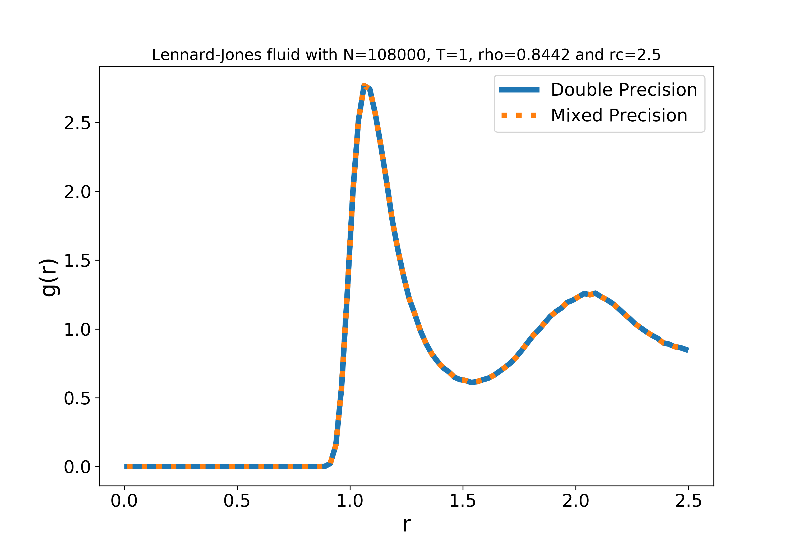

# Mixed versus Double Precision

By default LAMMPS stores the main variables in double precision. The USER-INTEL package uses single precision for most variables but double in certain situations such as accumulators. If you are worried that using a mixed precision code is causing problems then do a test against the double precision version. This was done for the standard Lennard-Jones fluid with the following results:




Below is the script used to generate the data:

```
units           lj
atom_style      atomic

lattice         fcc 0.8442
region          box block 0 30 0 30 0 30
create_box      1 box
create_atoms    1 box
mass            1 1.0

velocity        all create 1.0 87287

pair_style      lj/cut 2.5
pair_coeff      1 1 1.0 1.0 2.5

neighbor        0.3 bin
neigh_modify    every 20 delay 0 check no

fix             1 all nve
fix             2 all langevin 1.0 1.0 1.0 48279

compute         myRDF all rdf 100
fix             3 all ave/time 1000 1 50000 c_myRDF[*] file tmp.rdf mode vector

compute         myMSD all msd com yes

timestep        0.005

thermo_style    custom step press pe c_myMSD[1] c_myMSD[2] c_myMSD[3] c_myMSD[4]
thermo          1
run             50000
```
